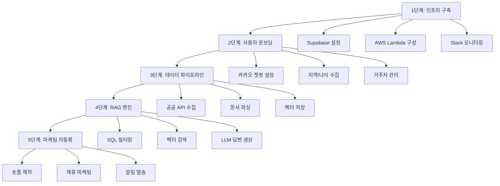

# 🚀 구현 방법 및 단계

## 1단계: 기초 인프라 및 데이터베이스 구축 (Foundation)

가장 먼저 데이터가 담길 그릇과 코드가 실행될 환경을 세팅합니다.

### 주요 작업
- **Supabase 프로젝트 설정**: `users`, `benefits`, `benefit_embeddings` 테이블 스키마를 생성합니다.
- **AWS Lambda 환경 구성**: SAM CLI를 활용해 파이썬 기반의 백엔드 환경을 구축하고 API Gateway와 연결합니다.
- **시스템 모니터링 연동**: 에러 발생 시 즉시 확인할 수 있도록 기존에 설정한 Slack 웹훅(`k-pulse.alert`)을 연결합니다.

---

## 2단계: 사용자 온보딩 및 위치 정보 관리 (User Logic)

사용자가 카카오 채널에 들어왔을 때 개인화된 정보를 제공하기 위한 첫 관문입니다.

### 주요 작업
- **카카오 챗봇 스킬(Skill) 설정**: 카카오 개발자 센터에서 사용자의 메시지를 Lambda로 던져줄 웹훅 주소를 등록합니다.
- **지역/나이 수집 로직**: 챗봇 첫 화면에서 '지역 설정'과 '출생 연도'를 입력받아 Supabase `users` 테이블에 저장합니다.
- **거주지 이전 대응**: 유저가 수동으로 지역을 변경하거나, 접속 IP 기반으로 지역이 다를 경우 변경을 제안하는 로직을 구현합니다.

---

## 3단계: 공공 데이터 수집 파이프라인 (Data Pipeline)

서비스의 핵심인 '신선한 혜택 정보'를 자동으로 모으는 과정입니다.

### 주요 작업
- **공공 API 수집기 작성**: 보조금24, 복지로 등 공공데이터포털 API를 통해 정형 데이터를 주기적으로 가져옵니다.
- **비정형 문서 파싱**: 지자체 사이트의 PDF, Excel 공고문을 다운로드하여 텍스트를 추출하고 LLM으로 요약합니다.
- **임베딩 및 벡터 저장**: 요약된 텍스트를 벡터로 변환하여 `benefit_embeddings` 테이블에 적재합니다.

---

## 4단계: 하이브리드 RAG 엔진 구현 (AI Core)

정확한 정보를 친절하게 답변하는 똑순이의 '두뇌'를 완성합니다.

### 주요 작업
- **SQL 필터링 엔진**: 유저의 질문이 들어오면 해당 유저의 `region`과 `age`에 맞는 혜택만 SQL로 1차 필터링합니다.
- **벡터 유사도 검색**: 필터링된 범위 내에서 질문과 가장 유사한 혜택 내용을 벡터 검색으로 찾아냅니다.
- **LLM 프롬프트 엔지니어링**: 검색된 정보를 바탕으로 시니어 눈높이에 맞는 따뜻하고 명확한 답변을 생성하도록 페르소나를 설정합니다.

---

## 5단계: 마케팅 자동화 및 수익화 연동 (Operation & Growth)

유저를 모으고 실제 매출을 발생시키는 단계입니다.

### 주요 작업
- **숏폼 자동 제작 파이프라인**: K-Pulse 프로젝트에서 사용한 기술을 활용해, 신규 공고 발생 시 자동으로 유튜브 쇼츠용 대본과 영상을 생성합니다.
- **제휴 마케팅 연동**: 답변 하단이나 리치 메뉴에 쿠팡 파트너스, 알리 어필리에이트 API를 활용한 맞춤 상품 링크를 노출합니다.
- **알림톡/메시지 발송 스케줄러**: 정기적으로 새로운 혜택을 알려주는 Push 메시지 발송 기능을 구현합니다.

---

## 구현 순서 요약

---

## 참고사항

- 각 단계는 순차적으로 진행하되, 1-2단계는 병렬로 작업 가능합니다.
- K-Pulse 프로젝트의 기존 인프라(Slack 웹훅, 숏폼 생성 파이프라인)를 최대한 재활용합니다.
- 초기에는 서울시 25개 구를 타겟으로 시작하여 점진적으로 확장합니다.
