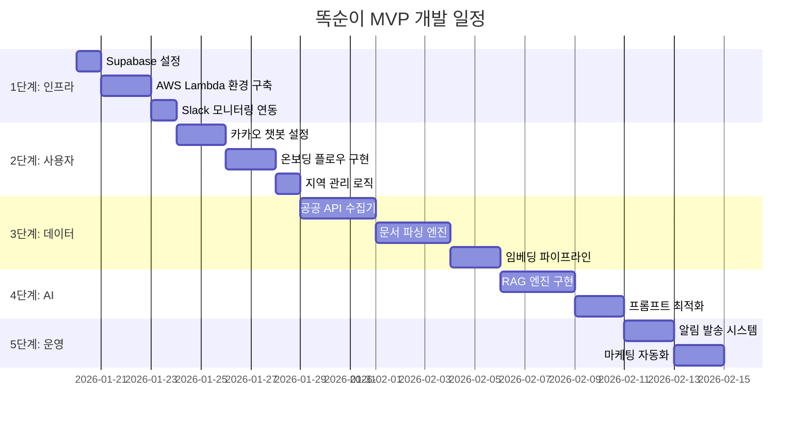

# 🎯 똑순이 프로젝트 - 구체적 실행 계획

## 전체 타임라인 (4주 MVP 완성 목표)



---

## Week 1: 인프라 및 사용자 온보딩 (1-2단계)

### Day 1-2: Supabase 및 AWS 기초 설정

#### ✅ Task 1.1: Supabase 프로젝트 생성
```bash
# 1. Supabase 대시보드 접속
# https://supabase.com/dashboard

# 2. 새 프로젝트 생성
# - 프로젝트명: ttok-sun-i-prod
# - 리전: Northeast Asia (Seoul) - ap-northeast-2
# - 데이터베이스 비밀번호: 안전하게 저장

# 3. SQL Editor에서 스키마 실행
# docs/DATABASE_SCHEMA.md의 모든 SQL 복사 후 실행

# 4. 환경 변수 저장
SUPABASE_URL=https://[프로젝트ID].supabase.co
SUPABASE_ANON_KEY=[공개 API 키]
SUPABASE_SERVICE_KEY=[서비스 역할 키]
```

**체크리스트:**
- [ ] Supabase 프로젝트 생성 완료
- [ ] 모든 테이블 생성 확인 (9개)
- [ ] pgvector 확장 활성화 확인
- [ ] RLS 정책 적용 확인
- [ ] API 키 안전하게 저장 (AWS Secrets Manager)

---

#### ✅ Task 1.2: AWS SAM 프로젝트 초기화

```bash
# 1. 프로젝트 디렉토리 구조 생성
cd /Users/a1102028/Documents/ttok-sun-i
mkdir -p backend/{functions,layers,common}

# 2. SAM 템플릿 생성
cat > backend/template.yaml << 'EOF'
AWSTemplateFormatVersion: '2010-09-09'
Transform: AWS::Serverless-2016-10-31
Description: 똑순이 서버리스 백엔드

Globals:
  Function:
    Timeout: 30
    MemorySize: 512
    Runtime: python3.11
    Environment:
      Variables:
        SUPABASE_URL: !Ref SupabaseUrl
        SUPABASE_SERVICE_KEY: !Ref SupabaseServiceKey
        SLACK_WEBHOOK_URL: !Ref SlackWebhookUrl

Parameters:
  SupabaseUrl:
    Type: String
    Description: Supabase 프로젝트 URL
  SupabaseServiceKey:
    Type: String
    NoEcho: true
    Description: Supabase 서비스 역할 키
  SlackWebhookUrl:
    Type: String
    NoEcho: true
    Description: Slack 웹훅 URL (k-pulse.alert)

Resources:
  # 카카오 챗봇 웹훅 핸들러
  KakaoWebhookFunction:
    Type: AWS::Serverless::Function
    Properties:
      CodeUri: functions/kakao_webhook/
      Handler: app.lambda_handler
      Events:
        KakaoApi:
          Type: Api
          Properties:
            Path: /kakao/webhook
            Method: post
      Policies:
        - Statement:
          - Effect: Allow
            Action:
              - bedrock:InvokeModel
            Resource: '*'

  # 데이터 수집 배치 작업
  DataCollectorFunction:
    Type: AWS::Serverless::Function
    Properties:
      CodeUri: functions/data_collector/
      Handler: app.lambda_handler
      Timeout: 900  # 15분
      MemorySize: 1024
      Events:
        DailySchedule:
          Type: Schedule
          Properties:
            Schedule: cron(0 2 * * ? *)  # 매일 오전 11시 (KST)
      Policies:
        - Statement:
          - Effect: Allow
            Action:
              - bedrock:InvokeModel
            Resource: '*'

Outputs:
  KakaoWebhookUrl:
    Description: 카카오 챗봇 웹훅 URL
    Value: !Sub 'https://${ServerlessRestApi}.execute-api.${AWS::Region}.amazonaws.com/Prod/kakao/webhook'
EOF

# 3. requirements.txt 생성
cat > backend/requirements.txt << 'EOF'
supabase==2.3.4
boto3==1.34.34
requests==2.31.0
python-dotenv==1.0.0
pydantic==2.5.3
EOF

# 4. 공통 유틸리티 모듈 생성
mkdir -p backend/common
touch backend/common/__init__.py
```

**체크리스트:**
- [ ] SAM 템플릿 생성 완료
- [ ] 디렉토리 구조 생성 완료
- [ ] requirements.txt 작성 완료

---

#### ✅ Task 1.3: Slack 모니터링 연동

```python
# backend/common/slack_notifier.py
import os
import json
import requests
from datetime import datetime

class SlackNotifier:
    def __init__(self):
        self.webhook_url = os.environ.get('SLACK_WEBHOOK_URL')
    
    def send_alert(self, title: str, message: str, level: str = 'INFO'):
        """
        Slack 알림 발송
        level: INFO, WARNING, ERROR
        """
        color_map = {
            'INFO': '#36a64f',
            'WARNING': '#ff9900',
            'ERROR': '#ff0000'
        }
        
        payload = {
            'attachments': [{
                'color': color_map.get(level, '#808080'),
                'title': f'[똑순이] {title}',
                'text': message,
                'footer': '똑순이 모니터링',
                'ts': int(datetime.now().timestamp())
            }]
        }
        
        try:
            response = requests.post(
                self.webhook_url,
                json=payload,
                timeout=5
            )
            response.raise_for_status()
        except Exception as e:
            print(f"Slack 알림 실패: {e}")
    
    def send_sync_report(self, source: str, success: int, failed: int, duplicates: int):
        """데이터 수집 결과 리포트"""
        message = f"""
📊 데이터 수집 완료
• 출처: {source}
• 성공: {success}건
• 실패: {failed}건
• 중복 제거: {duplicates}건
        """
        level = 'INFO' if failed == 0 else 'WARNING'
        self.send_alert('데이터 수집 완료', message, level)
```

**체크리스트:**
- [ ] Slack 웹훅 URL 발급 (기존 k-pulse.alert 채널 사용)
- [ ] SlackNotifier 클래스 작성
- [ ] 테스트 메시지 발송 확인

---

### Day 3-5: 카카오 챗봇 설정 및 온보딩

#### ✅ Task 2.1: 카카오 개발자 센터 설정

```bash
# 1. 카카오 개발자 센터 접속
# https://developers.kakao.com/

# 2. 애플리케이션 생성
# - 앱 이름: 똑순이
# - 사업자명: [본인 정보]

# 3. 카카오톡 채널 생성
# https://center-pf.kakao.com/
# - 채널명: 똑순이
# - 검색용 아이디: @ttok-sun-i

# 4. 챗봇 관리자센터 설정
# - 스킬 서버 URL: [AWS API Gateway URL]/kakao/webhook
# - 시나리오 설정: 폴백 블록에 스킬 연결
```

**시나리오 구조:**
```
[시작 블록]
  ├─ 신규 사용자 → [온보딩 스킬]
  │   ├─ 지역 설정
  │   ├─ 출생연도 입력
  │   └─ 성별 선택 (선택)
  │
  └─ 기존 사용자 → [메인 메뉴]
      ├─ 혜택 찾기 → [RAG 스킬]
      ├─ 내 정보 수정 → [프로필 스킬]
      └─ 북마크 보기 → [북마크 스킬]
```

**체크리스트:**
- [ ] 카카오 앱 생성 완료
- [ ] 카카오톡 채널 생성 완료
- [ ] 챗봇 스킬 서버 URL 등록
- [ ] 시나리오 기본 구조 생성

---

#### ✅ Task 2.2: 온보딩 Lambda 함수 구현

```python
# backend/functions/kakao_webhook/app.py
import json
import os
from supabase import create_client
from common.slack_notifier import SlackNotifier

supabase = create_client(
    os.environ['SUPABASE_URL'],
    os.environ['SUPABASE_SERVICE_KEY']
)
slack = SlackNotifier()

def lambda_handler(event, context):
    """카카오 챗봇 웹훅 핸들러"""
    try:
        body = json.loads(event['body'])
        user_key = body['userRequest']['user']['id']  # plusfriend_user_key
        utterance = body['userRequest']['utterance']
        
        # 사용자 존재 여부 확인
        user = get_or_create_user(user_key)
        
        # 온보딩 상태 확인
        if not user['region_code'] or not user['birth_year']:
            return handle_onboarding(body, user)
        
        # 일반 대화 처리
        return handle_conversation(body, user)
        
    except Exception as e:
        slack.send_alert('웹훅 에러', str(e), 'ERROR')
        return error_response()

def get_or_create_user(kakao_user_id: str):
    """사용자 조회 또는 생성"""
    result = supabase.table('users').select('*').eq('kakao_user_id', kakao_user_id).execute()
    
    if result.data:
        return result.data[0]
    
    # 신규 사용자 생성
    new_user = supabase.table('users').insert({
        'kakao_user_id': kakao_user_id
    }).execute()
    
    slack.send_alert('신규 사용자', f'사용자 ID: {kakao_user_id}', 'INFO')
    return new_user.data[0]

def handle_onboarding(body, user):
    """온보딩 플로우 처리"""
    # 지역 설정 미완료
    if not user['region_code']:
        return {
            'statusCode': 200,
            'body': json.dumps({
                'version': '2.0',
                'template': {
                    'outputs': [{
                        'simpleText': {
                            'text': '안녕하세요! 똑순이입니다 👵\n\n맞춤 혜택을 알려드리려면 거주 지역이 필요해요.\n\n예) 서울특별시 은평구\n예) 부산광역시 해운대구'
                        }
                    }]
                }
            })
        }
    
    # 출생연도 미완료
    if not user['birth_year']:
        return {
            'statusCode': 200,
            'body': json.dumps({
                'version': '2.0',
                'template': {
                    'outputs': [{
                        'simpleText': {
                            'text': '출생 연도를 알려주세요.\n\n예) 1955\n예) 1960'
                        }
                    }]
                }
            })
        }

def handle_conversation(body, user):
    """일반 대화 처리 (RAG)"""
    # 다음 단계에서 구현
    pass

def error_response():
    """에러 응답"""
    return {
        'statusCode': 200,
        'body': json.dumps({
            'version': '2.0',
            'template': {
                'outputs': [{
                    'simpleText': {
                        'text': '죄송합니다. 일시적인 오류가 발생했어요.\n잠시 후 다시 시도해주세요.'
                    }
                }]
            }
        })
    }
```

**체크리스트:**
- [ ] Lambda 함수 작성 완료
- [ ] Supabase 연동 테스트
- [ ] 온보딩 플로우 테스트
- [ ] 에러 핸들링 확인

---

## Week 2: 데이터 수집 파이프라인 (3단계)

### Day 6-8: 공공 API 수집기 구현

#### ✅ Task 3.1: 보조금24 API 연동

```python
# backend/functions/data_collector/collectors/bojogeum24.py
import requests
from typing import List, Dict
from datetime import datetime

class Bojogeum24Collector:
    """보조금24 공공데이터 수집기"""
    
    BASE_URL = 'https://api.odcloud.kr/api'
    
    def __init__(self, api_key: str):
        self.api_key = api_key
    
    def collect_benefits(self) -> List[Dict]:
        """혜택 데이터 수집"""
        endpoint = f'{self.BASE_URL}/15059028/v1/uddi:c2e3c4c6-3a3e-4f3f-a8a2-2b3c4d5e6f7g'
        
        params = {
            'serviceKey': self.api_key,
            'page': 1,
            'perPage': 100
        }
        
        all_benefits = []
        
        while True:
            response = requests.get(endpoint, params=params)
            response.raise_for_status()
            data = response.json()
            
            if not data.get('data'):
                break
            
            for item in data['data']:
                benefit = self._parse_benefit(item)
                all_benefits.append(benefit)
            
            # 다음 페이지
            if data['currentCount'] < params['perPage']:
                break
            params['page'] += 1
        
        return all_benefits
    
    def _parse_benefit(self, raw_data: Dict) -> Dict:
        """원본 데이터를 스키마에 맞게 변환"""
        return {
            'title': raw_data.get('서비스명'),
            'category_codes': self._map_category(raw_data.get('서비스분야')),
            'target_age_min': self._parse_age(raw_data.get('연령정보')),
            'region_codes': self._parse_regions(raw_data.get('지역정보')),
            'content': raw_data.get('서비스내용'),
            'original_url': raw_data.get('상세조회URL'),
            'source_name': '보조금24',
            'application_start_date': self._parse_date(raw_data.get('접수시작일시')),
            'application_end_date': self._parse_date(raw_data.get('접수종료일시'))
        }
    
    def _map_category(self, raw_category: str) -> List[str]:
        """카테고리 매핑"""
        mapping = {
            '의료': ['C01'],
            '생활': ['C02'],
            '주거': ['C03'],
            '문화': ['C04'],
            '교육': ['C05'],
            '일자리': ['C06'],
            '돌봄': ['C07']
        }
        # 실제 매핑 로직 구현
        return ['C08']  # 기본값
```

**체크리스트:**
- [ ] 공공데이터포털에서 API 키 발급
- [ ] 보조금24 API 연동 완료
- [ ] 데이터 파싱 로직 구현
- [ ] 카테고리 매핑 테이블 완성

---

#### ✅ Task 3.2: 행정동 코드 자동 수집

```python
# backend/scripts/sync_region_codes.py
import requests
from supabase import create_client
import os

def sync_region_codes():
    """행정안전부 행정표준코드 동기화"""
    
    # 행정안전부 API
    api_url = 'https://www.code.go.kr/api/getStdCodeList.do'
    params = {
        'serviceKey': os.environ['MOIS_API_KEY'],
        'locatadd_nm': '',  # 전체 조회
        'use_at': 'Y'  # 사용 중인 코드만
    }
    
    response = requests.get(api_url, params=params)
    data = response.json()
    
    supabase = create_client(
        os.environ['SUPABASE_URL'],
        os.environ['SUPABASE_SERVICE_KEY']
    )
    
    for item in data['stdCodeList']:
        region_data = {
            'code': item['stdCode'],
            'full_name': item['locatadd_nm'],
            'si_do': item['sido_nm'],
            'si_gun_gu': item['sigungu_nm'],
            'is_active': True
        }
        
        # Upsert (있으면 업데이트, 없으면 삽입)
        supabase.table('region_codes').upsert(region_data).execute()
    
    print(f'✅ {len(data["stdCodeList"])}개 행정동 코드 동기화 완료')

if __name__ == '__main__':
    sync_region_codes()
```

**체크리스트:**
- [ ] 행정안전부 API 키 발급
- [ ] 스크립트 작성 완료
- [ ] 초기 데이터 로드 완료 (약 3,500개)
- [ ] Lambda Cron으로 월 1회 자동 실행 설정

---

### Day 9-11: 문서 파싱 및 임베딩

#### ✅ Task 3.3: PDF/HWP 파싱 엔진

```python
# backend/functions/data_collector/parsers/document_parser.py
import boto3
import tempfile
from typing import Optional

class DocumentParser:
    """PDF, HWP, Excel 문서 파싱"""
    
    def __init__(self):
        self.s3 = boto3.client('s3')
        self.textract = boto3.client('textract')
    
    def parse_pdf(self, url: str) -> Optional[str]:
        """PDF 텍스트 추출"""
        # 1. S3에 임시 저장
        bucket = 'ttok-sun-i-temp-docs'
        key = f'temp/{url.split("/")[-1]}'
        
        # URL에서 다운로드
        import requests
        response = requests.get(url)
        self.s3.put_object(Bucket=bucket, Key=key, Body=response.content)
        
        # 2. Textract로 텍스트 추출
        result = self.textract.detect_document_text(
            Document={'S3Object': {'Bucket': bucket, 'Name': key}}
        )
        
        # 3. 텍스트 조합
        text = ''
        for block in result['Blocks']:
            if block['BlockType'] == 'LINE':
                text += block['Text'] + '\n'
        
        # 4. 임시 파일 삭제
        self.s3.delete_object(Bucket=bucket, Key=key)
        
        return text
    
    def parse_hwp(self, url: str) -> Optional[str]:
        """HWP 파일 처리 (pyhwp 사용)"""
        # HWP는 복잡하므로 초기에는 스킵하고 PDF만 처리
        return None
```

**체크리스트:**
- [ ] S3 버킷 생성 (ttok-sun-i-temp-docs)
- [ ] AWS Textract 권한 추가
- [ ] PDF 파싱 테스트
- [ ] HWP 파싱 방법 조사 (선택)

---

#### ✅ Task 3.4: 임베딩 파이프라인

```python
# backend/functions/data_collector/embeddings/titan_embedder.py
import boto3
import json
from typing import List

class TitanEmbedder:
    """Amazon Titan Embeddings V2 임베딩 생성기"""
    
    def __init__(self):
        self.bedrock = boto3.client('bedrock-runtime', region_name='us-east-1')
        self.model_id = 'amazon.titan-embed-text-v2:0'
    
    def embed_text(self, text: str) -> List[float]:
        """텍스트를 1024차원 벡터로 변환"""
        body = json.dumps({
            'inputText': text
        })
        
        response = self.bedrock.invoke_model(
            modelId=self.model_id,
            body=body
        )
        
        result = json.loads(response['body'].read())
        return result['embedding']
    
    def embed_chunks(self, chunks: List[str]) -> List[List[float]]:
        """여러 청크를 배치 임베딩"""
        return [self.embed_text(chunk) for chunk in chunks]
    
    def chunk_text(self, text: str, max_length: int = 500) -> List[str]:
        """긴 텍스트를 청크로 분할"""
        sentences = text.split('. ')
        chunks = []
        current_chunk = ''
        
        for sentence in sentences:
            if len(current_chunk) + len(sentence) < max_length:
                current_chunk += sentence + '. '
            else:
                if current_chunk:
                    chunks.append(current_chunk.strip())
                current_chunk = sentence + '. '
        
        if current_chunk:
            chunks.append(current_chunk.strip())
        
        return chunks
```

**체크리스트:**
- [ ] Bedrock Titan 모델 액세스 활성화
- [ ] 임베딩 생성 테스트
- [ ] 청크 분할 로직 검증
- [ ] Supabase에 벡터 저장 테스트

---

## Week 3: RAG 엔진 구현 (4단계)

### Day 12-14: 하이브리드 RAG 엔진

#### ✅ Task 4.1: SQL 필터링 + 벡터 검색

```python
# backend/functions/kakao_webhook/rag_engine.py
from typing import List, Dict
from supabase import Client
from embeddings.titan_embedder import TitanEmbedder

class HybridRAG:
    """하이브리드 RAG 엔진"""
    
    def __init__(self, supabase: Client):
        self.supabase = supabase
        self.embedder = TitanEmbedder()
    
    def search_benefits(self, query: str, user: Dict, top_k: int = 5) -> List[Dict]:
        """사용자 질문에 맞는 혜택 검색"""
        
        # 1. 질문 임베딩
        query_vector = self.embedder.embed_text(query)
        
        # 2. 사용자 나이 계산
        from datetime import datetime
        user_age = datetime.now().year - user['birth_year']
        
        # 3. 하이브리드 검색 쿼리
        result = self.supabase.rpc('search_benefits_hybrid', {
            'query_embedding': query_vector,
            'user_region': user['region_code'],
            'user_age': user_age,
            'user_gender': user.get('gender', 'ALL'),
            'limit_count': top_k
        }).execute()
        
        return result.data
```

**Supabase 함수 생성:**
```sql
-- 하이브리드 검색 함수
create or replace function search_benefits_hybrid(
  query_embedding vector(1024),
  user_region text,
  user_age int,
  user_gender text,
  limit_count int default 5
)
returns table (
  benefit_id bigint,
  title text,
  content text,
  original_url text,
  similarity float
) as $$
begin
  return query
  select 
    b.id as benefit_id,
    b.title,
    b.content,
    b.original_url,
    1 - (be.embedding <=> query_embedding) as similarity
  from benefits b
  join benefit_embeddings be on b.id = be.benefit_id
  where b.is_active = true
    and (b.application_end_date is null or b.application_end_date >= current_date)
    and (user_region = any(b.region_codes) or 'ALL' = any(b.region_codes))
    and (b.target_age_min is null or b.target_age_min <= user_age)
    and (b.target_age_max is null or b.target_age_max >= user_age)
    and (b.target_gender is null or b.target_gender in ('ALL', user_gender))
  order by be.embedding <=> query_embedding
  limit limit_count;
end;
$$ language plpgsql;
```

**체크리스트:**
- [ ] Supabase RPC 함수 생성
- [ ] RAG 엔진 클래스 구현
- [ ] 검색 정확도 테스트
- [ ] 응답 속도 측정 (목표: 2초 이내)

---

#### ✅ Task 4.2: LLM 답변 생성 (프롬프트 엔지니어링)

```python
# backend/functions/kakao_webhook/llm_generator.py
import boto3
import json

class AnswerGenerator:
    """시니어 친화적 답변 생성기"""
    
    def __init__(self):
        self.bedrock = boto3.client('bedrock-runtime', region_name='us-east-1')
        self.model_id = 'anthropic.claude-3-haiku-20240307-v1:0'
    
    def generate_answer(self, query: str, benefits: List[Dict], user: Dict) -> str:
        """검색된 혜택을 바탕으로 답변 생성"""
        
        # 컨텍스트 구성
        context = self._build_context(benefits)
        
        # 프롬프트
        prompt = f"""당신은 '똑순이'라는 이름의 친절한 시니어 혜택 안내 도우미입니다.

[역할]
- 5070 시니어 분들이 이해하기 쉽게 설명
- 따뜻하고 존중하는 말투 사용
- 핵심 정보 3가지: 대상, 금액, 신청방법

[사용자 정보]
- 거주지: {user.get('region_code', '미설정')}
- 나이: {2026 - user.get('birth_year', 1960)}세

[질문]
{query}

[검색된 혜택 정보]
{context}

[답변 규칙]
1. 인사말로 시작 (예: "안녕하세요, 똑순이예요 👵")
2. 혜택을 최대 3개까지만 소개
3. 각 혜택마다:
   - 누가 받을 수 있는지
   - 얼마를 받을 수 있는지
   - 어떻게 신청하는지
4. 마지막에 "더 궁금하신 점 있으시면 언제든 물어보세요!" 추가
5. 이모지 적절히 사용 (💰, 🏥, 🏠 등)

답변:"""

        body = json.dumps({
            'anthropic_version': 'bedrock-2023-05-31',
            'max_tokens': 1000,
            'messages': [{
                'role': 'user',
                'content': prompt
            }],
            'temperature': 0.7
        })
        
        response = self.bedrock.invoke_model(
            modelId=self.model_id,
            body=body
        )
        
        result = json.loads(response['body'].read())
        return result['content'][0]['text']
    
    def _build_context(self, benefits: List[Dict]) -> str:
        """혜택 리스트를 컨텍스트로 변환"""
        context = ''
        for i, benefit in enumerate(benefits[:3], 1):
            context += f"\n[혜택 {i}]\n"
            context += f"제목: {benefit['title']}\n"
            context += f"내용: {benefit['content']}\n"
            context += f"링크: {benefit['original_url']}\n"
        return context
```

**체크리스트:**
- [ ] Claude 3 Haiku 모델 액세스 활성화
- [ ] 프롬프트 템플릿 작성
- [ ] 다양한 질문으로 테스트
- [ ] 시니어 사용자 피드백 수집

---

## Week 4: 운영 및 마케팅 자동화 (5단계)

### Day 15-16: 알림 발송 시스템

#### ✅ Task 5.1: 카카오 알림톡 연동

```python
# backend/functions/notification_sender/app.py
import requests
from typing import List
from supabase import Client

class KakaoNotificationSender:
    """카카오 알림톡 발송"""
    
    def __init__(self, api_key: str, sender_key: str):
        self.api_key = api_key
        self.sender_key = sender_key
        self.base_url = 'https://api.solapi.com/messages/v4'
    
    def send_new_benefit_alert(self, user_id: str, benefit: Dict):
        """신규 혜택 알림"""
        message = f"""
🎁 새로운 혜택이 등록되었어요!

{benefit['title']}

📍 대상: {benefit.get('target_description', '확인 필요')}
💰 금액: {benefit.get('amount', '확인 필요')}
📅 마감: {benefit.get('application_end_date', '상시')}

자세히 보기 👉 [링크]
        """
        
        self._send_message(user_id, message)
    
    def send_deadline_alert(self, user_id: str, benefit: Dict, days_left: int):
        """마감 임박 알림"""
        message = f"""
⏰ 마감 {days_left}일 전!

{benefit['title']}

서둘러 신청하세요!
자세히 보기 👉 [링크]
        """
        
        self._send_message(user_id, message)
    
    def _send_message(self, user_id: str, message: str):
        """실제 메시지 발송"""
        # Solapi 또는 카카오 비즈메시지 API 사용
        pass
```

**체크리스트:**
- [ ] 카카오 비즈메시지 계정 생성
- [ ] 알림톡 템플릿 승인 받기
- [ ] 발송 로직 구현
- [ ] 중복 발송 방지 확인

---

### Day 17-18: 마케팅 자동화

#### ✅ Task 5.2: 숏폼 자동 생성 (K-Pulse 재활용)

```python
# backend/functions/shorts_generator/app.py
from moviepy.editor import *
import boto3

class ShortsGenerator:
    """유튜브 쇼츠 자동 생성"""
    
    def create_benefit_shorts(self, benefit: Dict) -> str:
        """혜택 정보를 숏폼 영상으로 변환"""
        
        # 1. LLM으로 대본 생성
        script = self._generate_script(benefit)
        
        # 2. TTS로 음성 생성 (AWS Polly)
        audio_path = self._generate_audio(script)
        
        # 3. 자막 영상 생성
        video_path = self._create_video(script, audio_path)
        
        # 4. S3 업로드
        s3_url = self._upload_to_s3(video_path)
        
        return s3_url
    
    def _generate_script(self, benefit: Dict) -> str:
        """숏폼 대본 생성 (30초 분량)"""
        # Claude로 생성
        prompt = f"""
다음 혜택 정보를 30초 유튜브 쇼츠 대본으로 만들어주세요.

혜택: {benefit['title']}
내용: {benefit['content']}

[대본 규칙]
- 첫 3초에 훅 (예: "60세 이상이면 무조건 받으세요!")
- 핵심 3가지만 간결하게
- 마지막에 CTA (예: "자세한 내용은 프로필 링크!")
        """
        # LLM 호출 로직
        return script
```

**체크리스트:**
- [ ] K-Pulse 숏폼 생성 코드 이식
- [ ] AWS Polly TTS 연동
- [ ] 자막 생성 로직 구현
- [ ] 유튜브 자동 업로드 (선택)

---

## 최종 체크리스트 및 런칭

### Day 19-20: 통합 테스트 및 배포

#### ✅ 런칭 전 체크리스트

**인프라:**
- [ ] Supabase 프로덕션 환경 설정
- [ ] AWS Lambda 배포 완료
- [ ] API Gateway HTTPS 인증서 설정
- [ ] Slack 알림 정상 작동

**데이터:**
- [ ] 행정동 코드 3,500개 로드
- [ ] 초기 혜택 데이터 100개 이상 수집
- [ ] 벡터 임베딩 생성 완료
- [ ] HNSW 인덱스 생성 확인

**챗봇:**
- [ ] 카카오 챗봇 시나리오 완성
- [ ] 온보딩 플로우 테스트 (10명)
- [ ] RAG 답변 품질 검증
- [ ] 응답 속도 2초 이내 확인

**운영:**
- [ ] 매일 오전 11시 데이터 수집 Cron 설정
- [ ] 에러 발생 시 Slack 알림 확인
- [ ] 사용자 데이터 백업 설정
- [ ] RLS 정책 보안 검증

**마케팅:**
- [ ] 유튜브 채널 개설
- [ ] 첫 숏폼 10개 제작
- [ ] 카카오톡 채널 홍보 메시지 작성

---

## 런칭 후 1개월 로드맵

### Week 5-8: 사용자 피드백 및 개선

1. **사용자 확보 (목표: 100명)**
   - 지인 초대 (30명)
   - 유튜브 쇼츠 (50명)
   - 커뮤니티 홍보 (20명)

2. **데이터 품질 개선**
   - 사용자 질문 로그 분석
   - 답변 정확도 측정
   - 카테고리 분류 정교화

3. **기능 추가**
   - 북마크 기능
   - 신청 완료 체크리스트
   - 주간 다이제스트 알림

4. **수익화 준비**
   - 쿠팡 파트너스 API 연동
   - 제휴 상품 추천 로직
   - 전환율 추적

---

## 예상 비용 (월간)

| 항목 | 예상 비용 |
|------|----------|
| Supabase (무료 티어) | $0 |
| AWS Lambda (100만 요청) | ~$5 |
| AWS Bedrock (Titan + Claude) | ~$20 |
| AWS Textract (PDF 파싱) | ~$10 |
| 카카오 알림톡 (1,000건) | ~$15 |
| **총계** | **~$50/월** |

---

## 다음 액션

가장 먼저 시작할 작업을 선택해주세요:

1. **Supabase 프로젝트 생성 및 스키마 설치**
2. **AWS SAM 프로젝트 초기화**
3. **카카오 개발자 센터 설정**
4. **공공데이터 API 키 발급**

어떤 것부터 시작하시겠어요? 🚀
